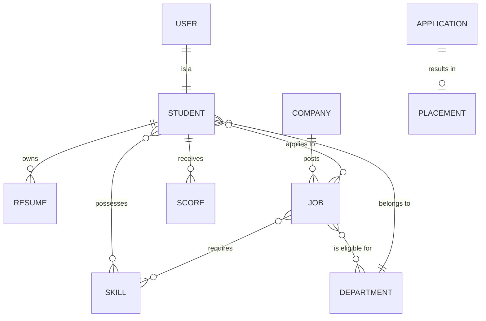
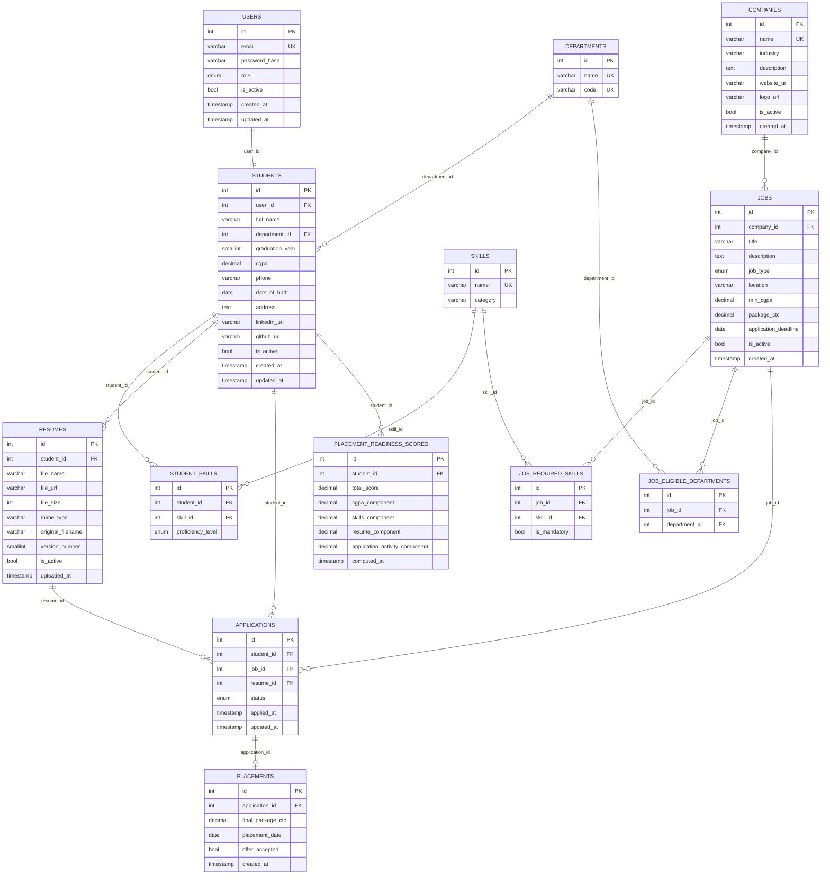

# Career Compass AI – Smart Placement Analytics Platform
### Day 2 – Database Design Document (PostgreSQL)
### Version 1.1 (Revised)

---

## 1. Design Philosophy

Before listing tables, three decisions shape everything below:

1. **`users` is separated from `students`.** Authentication concerns (email, password hash, role) and domain concerns (department, CGPA, batch) change for different reasons and at different rates. Mixing them into one table would violate separation of concerns and would force every future role (Recruiter, Super Admin) to carry irrelevant student columns. This also directly mirrors the backend's `auth` vs `students` module split from Day 1.
2. **Lookup/master data is normalized out, never hardcoded as free text.** `Department` and `Skill` become their own tables instead of VARCHAR columns repeated across `students` and `jobs`. This is what eliminates transitive dependencies and repeating groups — the core mechanical goal of 3NF — and it's also what makes analytics (Placement Dashboard) reliable, since "Computer Science" vs "CS" vs "Comp. Sci." typos become impossible.
3. **Outcomes are modeled separately from process.** An `applications` table tracks the funnel (Applied → Shortlisted → Selected → Rejected); a separate `placements` table records the *confirmed* final outcome. These are deliberately not the same table — an application's status is a process state that can still change, while a placement is a historical fact that should never be casually edited once created. This separation also keeps the Placement Dashboard's core queries (average package, placement %) simple, since they read from one small, unambiguous table rather than filtering a larger, mutable one.

---

## 2. Entity List (14 Tables)

| # | Entity | Module | Reason it Exists |
|---|---|---|---|
| 1 | `users` | Authentication | Single identity/auth record for every person in the system (student or admin) |
| 2 | `students` | Student Management | Domain profile data for users with role = student; kept separate from `users` |
| 3 | `departments` | Student Management (master) | Normalized department list; referenced by students and job eligibility |
| 4 | `skills` | Skills Management (master) | Normalized master list of skills; referenced by students and jobs |
| 5 | `student_skills` | Skills Management | Junction resolving the M:N between students and skills, carrying proficiency |
| 6 | `resumes` | Resume Management | Multiple resume versions per student, with one marked active |
| 7 | `companies` | Company Management | Recruiting organizations |
| 8 | `jobs` | Job Listings | Job postings, owned by a company |
| 9 | `job_required_skills` | Job Listings | Junction resolving M:N between jobs and required skills |
| 10 | `job_eligible_departments` | Job Listings | Junction resolving M:N between jobs and eligible departments |
| 11 | `applications` | Applications | Junction resolving M:N between students and jobs, carrying process status |
| 12 | `placements` | Placement Dashboard | One confirmed final outcome record per successful application |
| 13 | `placement_readiness_scores` | Placement Readiness Score | Historical, explainable score snapshots per student |
| 14 | *(no separate table)* `role` is an enum on `users`, not a table — see §3.1 rationale | Authentication | Avoids an unnecessary lookup table for a small, stable, code-level set of values |

No table exists purely for convenience — each one maps to either a real-world entity, a genuine M:N relationship needing its own attributes, or a normalization requirement. This was checked against the "avoid unnecessary tables" instruction explicitly: for example, `job_eligible_departments` might look excessive, but without it, eligibility would have to be stored as a comma-separated string or array in `jobs`, which breaks 1NF (repeating groups) and makes "find all jobs eligible for CSE" an unindexable string search instead of a join.

---

## 3. Entities, Attributes, Keys, and Constraints

### 3.1 `users` — Authentication

| Field | Type | Constraints | Description |
|---|---|---|---|
| `id` | INTEGER AUTO_INCREMENT | **PK**, NOT NULL | Surrogate identity key |
| `email` | VARCHAR(255) | **UNIQUE**, NOT NULL | Login identifier |
| `password_hash` | VARCHAR(255) | NOT NULL | Bcrypt/argon2 hash; never plaintext |
| `role` | ENUM('student','admin') | NOT NULL, DEFAULT 'student' | Determines authorization scope |
| `is_active` | BOOLEAN | NOT NULL, DEFAULT TRUE | Soft-deactivation flag; login denied if false |
| `created_at` | TIMESTAMP | NOT NULL, DEFAULT now() | Audit trail |
| `updated_at` | TIMESTAMP | NOT NULL, DEFAULT now() | Audit trail, updated on change |

**Why `role` is an ENUM, not a `roles` table:** the value set is small, fixed at the application-code level (authorization logic branches on it directly), and won't be end-user-managed. Normalizing it into a separate table would add a join to every auth check for no real benefit at this scale. This is a deliberate exception to normalization-for-its-own-sake, and is flagged explicitly since the assignment asks for every decision to be explained — over-normalizing here would hurt more than help.

### 3.2 `students` — Student Management

| Field | Type | Constraints | Description |
|---|---|---|---|
| `id` | INTEGER AUTO_INCREMENT | **PK** | Surrogate key |
| `user_id` | INTEGER | **FK → users.id**, UNIQUE, NOT NULL | Enforces the 1-to-1 with `users` |
| `full_name` | VARCHAR(150) | NOT NULL | Display name |
| `department_id` | INTEGER | **FK → departments.id**, NOT NULL | Student's department |
| `graduation_year` | SMALLINT | NOT NULL, CHECK (graduation_year BETWEEN 2000 AND 2100) | Year the student is due to graduate |
| `cgpa` | DECIMAL(4,2) | NOT NULL, CHECK (cgpa BETWEEN 0 AND 10) | Academic performance |
| `phone` | VARCHAR(15) | NULLABLE | Contact number |
| `date_of_birth` | DATE | NULLABLE | Personal detail |
| `address` | TEXT | NULLABLE | Optional contact detail |
| `linkedin_url` | VARCHAR(255) | NULLABLE | Optional link to the student's LinkedIn profile |
| `github_url` | VARCHAR(255) | NULLABLE | Optional link to the student's GitHub profile |
| `is_active` | BOOLEAN | NOT NULL, DEFAULT TRUE | Soft delete/deactivation |
| `created_at` | TIMESTAMP | NOT NULL, DEFAULT now() | Audit |
| `updated_at` | TIMESTAMP | NOT NULL, DEFAULT now() | Audit |

**Relationship:** `users (1) ── (1) students` — **One-to-One**. Enforced by the `UNIQUE` constraint on `students.user_id`. Modeled as 1:1 rather than folding into `users` directly, per the reasoning in §1.

**Why `linkedin_url` and `github_url` were added:** placement analytics benefit from more than just CGPA and self-declared skills — a student's GitHub activity (repositories, contribution history) and LinkedIn profile (endorsements, work history) are exactly the kind of external signals recruiters already look for manually. Storing them as structured, optional fields on `students` means: (a) recruiter-facing profile views (a likely final-year feature) can surface them directly without a new table, and (b) a future AI module could fetch and parse these URLs as additional inputs to the Placement Readiness Score, without any schema change — the columns already exist and are simply unused until that logic is built. Both are `NULLABLE` since not every student will have one or either profile, and requiring them would block profile completion unnecessarily.

### 3.3 `departments` — Master Data

| Field | Type | Constraints | Description |
|---|---|---|---|
| `id` | INTEGER | **PK** | Surrogate key |
| `name` | VARCHAR(100) | **UNIQUE**, NOT NULL | e.g., "Computer Science", "ECE" |
| `code` | VARCHAR(10) | **UNIQUE**, NOT NULL | Short code, e.g., "CSE" |

**Relationship:** `departments (1) ── (M) students` — **One-to-Many**. One department has many students; each student belongs to exactly one department.

### 3.4 `skills` — Master Data

| Field | Type | Constraints | Description |
|---|---|---|---|
| `id` | INTEGER | **PK** | Surrogate key |
| `name` | VARCHAR(100) | **UNIQUE**, NOT NULL | e.g., "React", "SQL", "Python" |
| `category` | VARCHAR(50) | NULLABLE | e.g., "Frontend", "Backend", "Database" — used for dashboard grouping |

### 3.5 `student_skills` — Junction (Skills Management)

| Field | Type | Constraints | Description |
|---|---|---|---|
| `id` | INTEGER | **PK** | Surrogate key (see note below) |
| `student_id` | INTEGER | **FK → students.id**, NOT NULL | |
| `skill_id` | INTEGER | **FK → skills.id**, NOT NULL | |
| `proficiency_level` | ENUM('Beginner','Intermediate','Advanced') | NOT NULL, DEFAULT 'Beginner' | |
| `UNIQUE (student_id, skill_id)` | — | composite constraint | Prevents duplicate skill entries for the same student |

**Relationship:** `students (M) ── (N) skills` — **Many-to-Many**, resolved via `student_skills`. A surrogate `id` is used instead of a composite PK (`student_id, skill_id`) so that the row can be referenced elsewhere later (e.g., if the final-year expansion adds skill-endorsement or evidence links) without restructuring the key.

### 3.6 `resumes` — Resume Management

| Field | Type | Constraints | Description |
|---|---|---|---|
| `id` | INTEGER | **PK** | Surrogate key |
| `student_id` | INTEGER | **FK → students.id**, NOT NULL | Owner |
| `file_name` | VARCHAR(255) | NOT NULL | The stored/generated file name (e.g., a UUID-based or hashed name used on disk/bucket, distinct from what the user originally called it) |
| `file_url` | VARCHAR(500) | NOT NULL | Full resolvable location of the file — a local path today, a cloud object URL/key later |
| `file_size` | INTEGER | NOT NULL, CHECK (file_size > 0) | Size in bytes; supports upload-limit validation and storage-usage reporting |
| `mime_type` | VARCHAR(100) | NOT NULL | e.g., `application/pdf`; validated at upload time so only expected formats are accepted |
| `original_filename` | VARCHAR(255) | NOT NULL | The name the student's file had on their own device; used for display/download |
| `version_number` | SMALLINT | NOT NULL, DEFAULT 1 | Increments per upload |
| `is_active` | BOOLEAN | NOT NULL, DEFAULT FALSE | Marks the one resume used for applications |
| `uploaded_at` | TIMESTAMP | NOT NULL, DEFAULT now() | Audit |

**Relationship:** `students (1) ── (M) resumes` — **One-to-Many**. A partial unique index enforces at most one `is_active = TRUE` row per student (see §5, Indexes).

**Why `file_path` was replaced with `file_name`, `file_url`, `file_size`, and `mime_type`:** a single `file_path` column conflates several distinct pieces of metadata into one string, which becomes a real limitation once storage moves off the local filesystem. Splitting it out is specifically a cloud-readiness decision:
- `file_url` holds whatever a given storage backend needs to locate the object — a local path today, an S3/GCS object key or signed URL tomorrow — without renaming the column at migration time.
- `file_name` (the stored name) is kept separate from `original_filename` (the user's own name for the file) because cloud object storage typically requires collision-free, sanitized keys, which are rarely the same string the user uploaded.
- `file_size` lets the application enforce upload limits and report storage usage without ever having to open the file or make a network call to the storage backend to check.
- `mime_type` lets the application validate and render files correctly (e.g., reject a `.exe` renamed to `.pdf`) and is required metadata by every major cloud storage API when the object is uploaded, so capturing it now avoids a later migration.

This does not affect normalization: all four fields are atomic, single-valued facts about one resume row, so 1NF/2NF/3NF are unaffected — this is a widening of one entity's attribute set, not a structural change.

### 3.7 `companies` — Company Management

| Field | Type | Constraints | Description |
|---|---|---|---|
| `id` | INTEGER | **PK** | Surrogate key |
| `name` | VARCHAR(150) | **UNIQUE**, NOT NULL | |
| `industry` | VARCHAR(100) | NULLABLE | e.g., "IT Services", "Product", "Analytics" |
| `description` | TEXT | NULLABLE | |
| `website_url` | VARCHAR(255) | NULLABLE | |
| `logo_url` | VARCHAR(500) | NULLABLE | Link to the company's logo image, used across job listings and the dashboard |
| `is_active` | BOOLEAN | NOT NULL, DEFAULT TRUE | Deactivation instead of deletion |
| `created_at` | TIMESTAMP | NOT NULL, DEFAULT now() | Audit |

**Why `logo_url` was added:** company logos are a small addition with a real payoff for usability — students scanning a job list or company directory recognize a brand by its logo far faster than by reading its name, and it makes the UI (job cards, dashboard company breakdowns) look like a real product rather than a plain data table. It's stored as a `NULLABLE` URL rather than binary image data in the database, consistent with how resumes now store `file_url` — the database holds a pointer to the asset, not the asset itself, which is the appropriate pattern once any file lives in cloud storage.

### 3.8 `jobs` — Job Listings

| Field | Type | Constraints | Description |
|---|---|---|---|
| `id` | INTEGER | **PK** | Surrogate key |
| `company_id` | INTEGER | **FK → companies.id**, NOT NULL | |
| `title` | VARCHAR(150) | NOT NULL | e.g., "Software Engineer Trainee" |
| `description` | TEXT | NULLABLE | |
| `job_type` | ENUM('Full-Time','Internship') | NOT NULL, DEFAULT 'Full-Time' | |
| `location` | VARCHAR(100) | NOT NULL | Work location, e.g., "Chennai", "Bangalore", or "Remote" |
| `min_cgpa` | DECIMAL(4,2) | NOT NULL, CHECK (min_cgpa BETWEEN 0 AND 10), DEFAULT 0 | Eligibility filter |
| `package_ctc` | DECIMAL(10,2) | NOT NULL, CHECK (package_ctc >= 0) | Annual CTC in relevant currency unit |
| `application_deadline` | DATE | NOT NULL | |
| `is_active` | BOOLEAN | NOT NULL, DEFAULT TRUE | |
| `created_at` | TIMESTAMP | NOT NULL, DEFAULT now() | Audit |

**Relationship:** `companies (1) ── (M) jobs` — **One-to-Many**.

**Why `location` was added:** location is one of the first filters a student applies when browsing job listings — "on-campus" placement drives increasingly include remote and multi-city roles, and students commonly narrow their search by city before anything else. Storing it as a plain `VARCHAR` (rather than a normalized `locations` master table) is a deliberate scope decision: unlike `departments` or `skills`, job locations are typically free-form city names supplied by the recruiter at posting time and aren't reused as a controlled vocabulary elsewhere in the system, so a lookup table would add a join without a corresponding integrity benefit at this project's scale. If city-level analytics become a bigger requirement in the final year, this column can be normalized into a `locations` table later without breaking anything referencing it today.

### 3.9 `job_required_skills` — Junction (Job Listings)

| Field | Type | Constraints | Description |
|---|---|---|---|
| `id` | INTEGER | **PK** | Surrogate key |
| `job_id` | INTEGER | **FK → jobs.id**, NOT NULL | |
| `skill_id` | INTEGER | **FK → skills.id**, NOT NULL | |
| `is_mandatory` | BOOLEAN | NOT NULL, DEFAULT TRUE | Distinguishes must-have vs. nice-to-have skills |
| `UNIQUE (job_id, skill_id)` | — | composite constraint | |

**Relationship:** `jobs (M) ── (N) skills` — **Many-to-Many**. The `is_mandatory` flag is exactly why this needs its own junction table rather than a simple array column — it's a relationship *attribute*, not just a link.

### 3.10 `job_eligible_departments` — Junction (Job Listings)

| Field | Type | Constraints | Description |
|---|---|---|---|
| `id` | INTEGER | **PK** | Surrogate key |
| `job_id` | INTEGER | **FK → jobs.id**, NOT NULL | |
| `department_id` | INTEGER | **FK → departments.id**, NOT NULL | |
| `UNIQUE (job_id, department_id)` | — | composite constraint | |

**Relationship:** `jobs (M) ── (N) departments` — **Many-to-Many**. If a job has zero rows here, the application-layer convention is "open to all departments" — this is a business rule enforced in the service layer (Day 1's Service Layer), not the database, since it can't be cleanly expressed as a constraint.

### 3.11 `applications` — Applications Module

| Field | Type | Constraints | Description |
|---|---|---|---|
| `id` | INTEGER | **PK** | Surrogate key |
| `student_id` | INTEGER | **FK → students.id**, NOT NULL | |
| `job_id` | INTEGER | **FK → jobs.id**, NOT NULL | |
| `resume_id` | INTEGER | **FK → resumes.id**, NOT NULL | Snapshot of which resume was submitted |
| `status` | ENUM('Applied','Shortlisted','Selected','Rejected') | NOT NULL, DEFAULT 'Applied' | Funnel state |
| `applied_at` | TIMESTAMP | NOT NULL, DEFAULT now() | |
| `updated_at` | TIMESTAMP | NOT NULL, DEFAULT now() | Status change tracking |
| `UNIQUE (student_id, job_id)` | — | composite constraint | A student may apply to a given job only once |

**Relationship:** `students (M) ── (N) jobs` — **Many-to-Many**, resolved via `applications`, which itself carries process attributes (`status`, `resume_id`) — a textbook case for an "associative entity" rather than a plain junction table.

**Why `resume_id` is stored here and not inferred from `students.active_resume`:** the active resume can change after an application is submitted (a student may update their resume later). Storing the reference at application time preserves what was *actually submitted* for that job — an audit/correctness concern, not a normalization one.

### 3.12 `placements` — Placement Dashboard

| Field | Type | Constraints | Description |
|---|---|---|---|
| `id` | INTEGER | **PK** | Surrogate key |
| `application_id` | INTEGER | **FK → applications.id**, UNIQUE, NOT NULL | The specific application that resulted in placement |
| `final_package_ctc` | DECIMAL(10,2) | NOT NULL, CHECK (final_package_ctc >= 0) | Actual offered package (may differ from job's listed CTC) |
| `placement_date` | DATE | NOT NULL | |
| `offer_accepted` | BOOLEAN | NOT NULL, DEFAULT TRUE | A student can decline an offer |
| `created_at` | TIMESTAMP | NOT NULL, DEFAULT now() | Audit |

**Relationship:** `applications (1) ── (1) placements` — **One-to-One**. Enforced via `UNIQUE` on `application_id`. Only an application already in `status = 'Selected'` should have a `placements` row — this cross-table rule is validated in the Service Layer (application-level invariant, deliberately not pushed into a DB trigger, to keep the mini project's DB layer simple and the business rule visible in code for the viva).

**Why not derive placement stats directly from `applications.status = 'Selected'`:** a student could theoretically be "Selected" for two jobs but only accept and join one. `placements` captures the single ground-truth outcome used for all dashboard metrics (placement %, average package), keeping those queries simple and unambiguous.

### 3.13 `placement_readiness_scores` — Placement Readiness Score Module

| Field | Type | Constraints | Description |
|---|---|---|---|
| `id` | INTEGER | **PK** | Surrogate key |
| `student_id` | INTEGER | **FK → students.id**, NOT NULL | |
| `total_score` | DECIMAL(5,2) | NOT NULL, CHECK (total_score BETWEEN 0 AND 100) | Final computed readiness score |
| `cgpa_component` | DECIMAL(5,2) | NOT NULL | Contribution from academic performance |
| `skills_component` | DECIMAL(5,2) | NOT NULL | Contribution from skill count/relevance |
| `resume_component` | DECIMAL(5,2) | NOT NULL | Contribution from resume completeness |
| `application_activity_component` | DECIMAL(5,2) | NOT NULL | Contribution from application history/outcomes |
| `computed_at` | TIMESTAMP | NOT NULL, DEFAULT now() | When this snapshot was generated |

**Relationship:** `students (1) ── (M) placement_readiness_scores` — **One-to-Many**. Deliberately modeled as a *history* table (new row per computation) rather than one mutable row per student, so that score trends over time can be shown to the student ("your readiness improved after adding 3 skills") — a feature explicitly useful for both the mini project demo and the final-year ML upgrade path. The "current" score is simply the row with the latest `computed_at` per student, retrieved via an indexed query (§5).

**Why fixed component columns instead of an EAV-style `score_factors` table:** the four scoring factors are structurally fixed in the current rule-based design (defined in application code, not user-configurable), so normalizing them into a generic key-value table would be over-engineering for this phase and would make the score harder to query. §7 (Future Extensibility) explains exactly when this decision should be revisited.

---

## 4. Relationship Summary

| Relationship | Cardinality | Enforced By |
|---|---|---|
| `users` ↔ `students` | 1 : 1 | `students.user_id` FK + UNIQUE |
| `departments` ↔ `students` | 1 : M | `students.department_id` FK |
| `students` ↔ `skills` | M : N | `student_skills` junction |
| `students` ↔ `resumes` | 1 : M | `resumes.student_id` FK |
| `companies` ↔ `jobs` | 1 : M | `jobs.company_id` FK |
| `jobs` ↔ `skills` | M : N | `job_required_skills` junction |
| `jobs` ↔ `departments` | M : N | `job_eligible_departments` junction |
| `students` ↔ `jobs` | M : N | `applications` associative entity |
| `applications` ↔ `placements` | 1 : 1 | `placements.application_id` FK + UNIQUE |
| `students` ↔ `placement_readiness_scores` | 1 : M | `placement_readiness_scores.student_id` FK |

---

## 5. Normalization Walkthrough (up to 3NF)

**1NF (atomic values, no repeating groups):**
Every column holds a single atomic value. The clearest 1NF decision is rejecting the tempting shortcut of a `skills TEXT` column on `students` containing a comma-separated list — that would be a repeating group. Instead, `student_skills` gives each (student, skill) pair its own row.

**2NF (no partial dependency on a composite key):**
Every table here uses a single-column surrogate primary key (`id`), even junction tables like `student_skills` and `applications`. This sidesteps partial-dependency issues by construction — there's no composite PK for a non-key attribute to partially depend on. The *business* uniqueness (e.g., one student can't have duplicate entries for the same skill) is instead enforced with a `UNIQUE` composite constraint (`student_id, skill_id`), which gives the same integrity guarantee without the downsides of composite PKs (harder foreign-key references from other tables, as seen with `student_skills.id` in §3.5).

**3NF (no transitive dependency on non-key attributes):**
This is where most of the real design work happened:
- `students.department_name` was rejected in favor of `students.department_id → departments.name`. Without this, `department_name` would be transitively determined by `department_id`, and department renames would require updating every student row.
- Similarly, `jobs` doesn't store `company_name` — it references `companies.id`.
- `skills.category` living on `skills` (not duplicated onto `student_skills` or `job_required_skills`) avoids the same transitive dependency problem for skill categorization.

The schema is therefore in 3NF: every non-key attribute depends on the whole primary key and nothing but the primary key, in every table.

**3NF re-verification after Version 1.1:** every column added in this revision (`students.linkedin_url`, `students.github_url`, `companies.logo_url`, `jobs.location`, and the four resume file-metadata fields) is an atomic, single-valued fact that depends only on its own table's primary key, not on any other non-key attribute in that table. None of them introduce a new transitive dependency or a new candidate key, so 3NF continues to hold across the schema without any further changes.

---

## 6. Indexes for Performance

| Table | Index | Reason |
|---|---|---|
| `users` | UNIQUE index on `email` | Login lookups happen on every request; already implied by UNIQUE constraint but explicitly noted since it's the single hottest query in the system |
| `students` | Index on `department_id` | Dashboard filters and admin search by department constantly |
| `students` | Index on `graduation_year` | Dashboard filters by graduation year |
| `jobs` | Index on `location` | Location is a common student-facing filter and a likely dashboard breakdown dimension |
| `student_skills` | Composite index on `(student_id, skill_id)` | Backs the UNIQUE constraint and supports "does student X have skill Y" checks |
| `student_skills` | Index on `skill_id` | Supports "which students have skill Y" — used by both job eligibility checks and dashboard skill-demand analytics |
| `resumes` | Partial unique index on `student_id` WHERE `is_active = TRUE` | Enforces "at most one active resume per student" without a full composite key |
| `jobs` | Index on `company_id` | Listing jobs per company |
| `jobs` | Index on `application_deadline` | Filtering "currently open" jobs is a frequent query |
| `job_required_skills` | Index on `skill_id` | Supports "which jobs need skill Y" |
| `applications` | Composite index on `(student_id, job_id)` | Backs UNIQUE constraint; also the most common lookup ("has this student applied to this job") |
| `applications` | Index on `job_id` | Admins viewing all applicants for a job |
| `applications` | Index on `status` | Dashboard filters heavily by status |
| `placements` | Index on `placement_date` | Dashboard's date-range filters |
| `placement_readiness_scores` | Composite index on `(student_id, computed_at DESC)` | Fetching a student's latest score is the dominant query pattern here |

**General principle applied:** every foreign key column is indexed (Postgres does not do this automatically, unlike the primary key side), and every column that appears in a `WHERE`, `JOIN`, or `ORDER BY` in a known dashboard/analytics query gets a supporting index. No indexes were added speculatively beyond these observed access patterns, to avoid unnecessary write-amplification on a mini-project-scale dataset.

**Indexing impact of the Version 1.1 additions:** of the newly added columns, only `jobs.location` warranted a new index, since it's a direct filter column. `companies.logo_url`, `students.linkedin_url`/`github_url`, and the four new `resumes` fields (`file_name`, `file_url`, `file_size`, `mime_type`) are all either display-only metadata or accessed strictly by their owning row's existing primary/foreign key — none of them are filtered, joined, or sorted on independently, so adding indexes to them would only add write overhead with no query benefit.

---

## 7. Data Dictionary (Consolidated Reference)

| Field Name (used across tables) | Meaning |
|---|---|
| `id` | Surrogate primary key, system-generated, no business meaning |
| `*_id` (e.g. `student_id`, `job_id`) | Foreign key referencing the corresponding entity's `id` |
| `is_active` | Soft-delete/deactivation flag; `FALSE` hides a record from normal use without destroying history |
| `created_at` / `updated_at` | Standard audit timestamps present on all primary entities |
| `status` (applications) | Current stage in the recruitment funnel: Applied → Shortlisted → Selected → Rejected |
| `proficiency_level` (student_skills) | Self-declared skill level: Beginner / Intermediate / Advanced |
| `is_mandatory` (job_required_skills) | Whether a required skill is a hard filter or a preference |
| `total_score` (placement_readiness_scores) | 0–100 composite readiness score, sum of four weighted components |
| `offer_accepted` (placements) | Whether the student accepted the offer tied to this placement record |
| `min_cgpa` (jobs) | Minimum CGPA threshold used for eligibility filtering |
| `package_ctc` vs `final_package_ctc` | The former is the job posting's advertised figure; the latter (`placements`) is the actual individually offered figure, which can legitimately differ |

---

## 8. Conceptual ER Diagram

*(Entities and relationships only — no attributes, no cardinality detail beyond relationship names. This is the "big picture" view suitable for explaining the system to a non-technical evaluator.)*

---

## 9. Logical ER Diagram

*(Full attribute list, primary keys, foreign keys, and precise cardinality — the direct blueprint for the eventual SQLAlchemy models, though no code is generated here.)*

---

## 10. Why Each Table Exists (Summary)

- **`users`** — single source of truth for identity/auth, decoupled from role-specific data.
- **`students`** — student-specific profile data, kept out of `users` to keep auth lean and role-agnostic.
- **`departments`** — eliminates repeated/inconsistent department strings; enables department-level analytics.
- **`skills`** — eliminates repeated/inconsistent skill strings; enables skill-demand analytics.
- **`student_skills`** — the only correct way to model a M:N relationship carrying its own attribute (`proficiency_level`).
- **`resumes`** — supports the explicit requirement of multiple resume *versions* per student.
- **`companies`** — recruiter-side entity, independent lifecycle from jobs.
- **`jobs`** — postings, correctly scoped under a company (1:M), not duplicated per department/skill.
- **`job_required_skills` / `job_eligible_departments`** — both are genuine M:N relationships with attributes (`is_mandatory`) or business rules that cannot be safely flattened into arrays without breaking 1NF and queryability.
- **`applications`** — associative entity for the M:N between students and jobs, carrying process state.
- **`placements`** — isolates confirmed, immutable outcomes from the mutable application funnel, simplifying every dashboard query.
- **`placement_readiness_scores`** — historical, explainable score log, not a single overwritten value, to support trend display and future model evaluation.

---

## 11. Future Extensibility for AI Modules

The schema was designed so the final-year AI upgrades listed in Day 1's Future Scope don't require breaking migrations, only additive ones:

1. **ML-based Placement Prediction:** `placement_readiness_scores` already stores a timestamped history per student. When the rule-based formula is replaced by a trained model, only the *computation* changes (in the Service Layer) — the table can gain an optional `model_version VARCHAR` column to distinguish rule-based vs. ML-based rows, with no restructuring needed. If the model later needs dozens of dynamic features instead of four fixed ones, a `score_factors` EAV-style table (`score_id FK, factor_name, factor_value, weight`) can be introduced *alongside* the existing fixed columns without deleting them — an additive migration, not a breaking one.
2. **Resume Parsing/NLP:** `resumes` can gain nullable columns like `parsed_text TEXT` or `extracted_skills JSONB` without touching any other table, since resume parsing is purely additive metadata on an existing entity.
3. **Recommendation Engine:** a new `job_recommendations` table (`student_id FK, job_id FK, relevance_score, generated_at`) slots in cleanly, reusing existing `students` and `jobs` foreign keys — no changes to either table required.
4. **Recruiter role:** since `users.role` is already an enum sized for growth, adding `'recruiter'` is a one-line enum change; a `recruiters` table (mirroring `students`' 1:1-with-`users` pattern) can be added the same way `students` was added, without touching `students` at all.
5. **Notifications/Interview Scheduling:** both are naturally new, independent tables referencing existing `applications`/`students` foreign keys — no modification to the schema designed today.

The consistent theme: every future AI capability attaches to an *existing* entity via a new table or a nullable column, rather than requiring today's tables to be restructured. That was the actual design goal behind normalizing early and modeling outcomes/process/history as separate, precise tables instead of convenient blobs.

---

## 12. Revision Summary — Version 1.1

This revision preserved the original schema, all 14 entities, and all relationships exactly as designed on Day 2. The following targeted changes were applied:

1. **Primary key standardization.** All occurrences of `INTEGER / UUID` (on `users.id`, `students.id`, and `students.user_id`) were standardized to `INTEGER AUTO_INCREMENT`, since UUIDs added unnecessary complexity for an MCA Mini Project's scale and grading scope.
2. **Field rename:** `students.batch_year` → `students.graduation_year`, updated consistently in the entity table, the Indexes section, and the Logical ER Diagram.
3. **`resumes` table restructured for cloud readiness:** `file_path` was replaced with four fields — `file_name`, `file_url`, `file_size`, `mime_type` — with an explanation of why this split matters once storage moves to a cloud provider. Updated in the entity table and the Logical ER Diagram.
4. **`companies` table:** added `logo_url` (nullable), with rationale for branding/UI purposes.
5. **`jobs` table:** added `location` (e.g., "Chennai", "Bangalore", "Remote"), with rationale for student-facing filtering, plus a supporting index.
6. **`students` table:** added `linkedin_url` and `github_url` (both nullable), with rationale for placement analytics and future recruiter-facing profiles.
7. **3NF re-verified:** confirmed in §5 that all newly added columns are atomic, single-valued, and depend only on their own table's primary key — no transitive dependencies introduced.
8. **Relationships, constraints, and diagrams re-checked:** no relationship, cardinality, or table was altered; both the Conceptual and Logical ER Diagrams were updated only to reflect the renamed/added columns above.
9. **Indexes updated:** `students.batch_year` index renamed to `students.graduation_year`; one new index added on `jobs.location`. No other indexing changes were needed — the remaining new columns are display-only metadata, not filter/join/sort targets.
10. No tables were added, removed, or renamed. No entity relationships were modified.

---

*End of Day 2 Database Design Document — Version 1.1.*